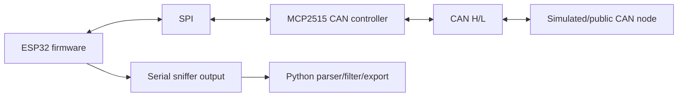

# CAN J1939 Firmware Sniffer Lab

[](https://github.com/guilherme-lacerda-tech/can-j1939-firmware-sniffer-lab/actions/workflows/ci.yml)
[](https://github.com/guilherme-lacerda-tech/can-j1939-firmware-sniffer-lab/actions/workflows/firmware.yml)
[](https://github.com/guilherme-lacerda-tech/can-j1939-firmware-sniffer-lab/actions/workflows/security.yml)
[](https://github.com/guilherme-lacerda-tech/can-j1939-firmware-sniffer-lab/releases)
[](LICENSE)

Public ESP32/MCP2515 CAN/J1939 sniffer lab with firmware concepts, extended CAN ID parsing, filters, synthetic frames, Python analysis tooling and export support.

Portuguese documentation: [README.pt-BR.md](README.pt-BR.md), [docs/bench-setup.md](docs/bench-setup.md) and [docs/hardware-validation.md](docs/hardware-validation.md).

## Why

J1939 bench work is more than reading a CAN ID. A useful sniffer needs firmware-side frame capture, timestamps, extended identifiers, filtering, serial output, host-side parsing, statistics and export. This project demonstrates those concepts with synthetic/public examples only.

## Features

- ESP32/Arduino-style MCP2515 firmware skeleton.
- CAN frame output with timestamp, extended CAN ID, DLC and payload.
- Generic J1939 parsing for priority, PGN, source address and destination address when applicable.
- Python parser for sniffer serial lines.
- Filtering by PGN, source and destination.
- CSV and JSON export.
- Synthetic CAN/J1939 dataset for hardware-free CI and demos.
- Fake serial source abstraction plus parser throughput benchmark for larger synthetic datasets.
- Tests for malformed frames, PGN extraction, filtering, statistics and exports.

## Architecture



## Tech Stack

- Python 3.11+
- PyTest
- coverage.py
- Ruff
- Arduino-style ESP32 C++ firmware skeleton
- MCP2515 concepts
- GitHub Actions
- CodeQL and dependency review

## Quick Start

```bash
python -m pip install -e ".[dev]"
j1939-sniffer-lab simulate
j1939-sniffer-lab simulate --pgn 61444 --json reports/frames.json --csv reports/frames.csv
```

Parse a text file using the public sniffer line format:

```text
timestamp_ms,can_id_hex,dlc,payload_hex
100,0x18F00401,8,11 22 33 44 55 66 77 88
```

```bash
j1939-sniffer-lab parse-file examples/synthetic_frames.txt
```

## Demo / Simulation

Simulation mode is mandatory and works without CAN hardware:

```bash
j1939-sniffer-lab simulate --source 0x01
j1939-sniffer-lab simulate --destination 0xFF
```

All frames are synthetic and use generic/public J1939 parsing rules. No proprietary PGNs or corporate logs are included.

## Tests

```bash
python -m ruff check .
python -m pytest --cov --cov-report=term-missing -q
```

## Project Structure

```text
firmware/
  include/sniffer_config.h
  src/main.cpp
src/can_j1939_firmware_sniffer_lab/
  cli.py
  exporters.py
  filtering.py
  j1939.py
  serial_parser.py
  simulation.py
tests/
docs/
examples/
```

## Engineering Decisions

- The Python tooling is the validated CI path.
- The firmware is intentionally public and generic, avoiding vendor or corporate-specific behavior.
- The new lab goes deeper than a bench reader by covering firmware capture, filtering, exports and host-side statistics.

## Security

Do not commit real vehicle/customer data, proprietary PGNs, plates, VINs, internal logs, serial numbers, private firmware or corporate bench screenshots.

## Limitations

- Simulation/software validation completed; hardware validation pending.
- Firmware skeleton compile is validated when the firmware workflow is enabled and green; physical CAN bus validation is still pending.
- Physical bus timing and electrical behavior are not measured in this release.

## Related Projects

- [j1939-can-bench-reader](https://github.com/guilherme-lacerda-tech/j1939-can-bench-reader): related compact J1939 parser project.
- This repository is the deeper firmware/sniffer/filter/export lab.

## Roadmap

- Add optional PlatformIO build once the toolchain is available.
- Add live serial reader mode with `pyserial`.
- Add richer public PGN examples and benchmark datasets.

