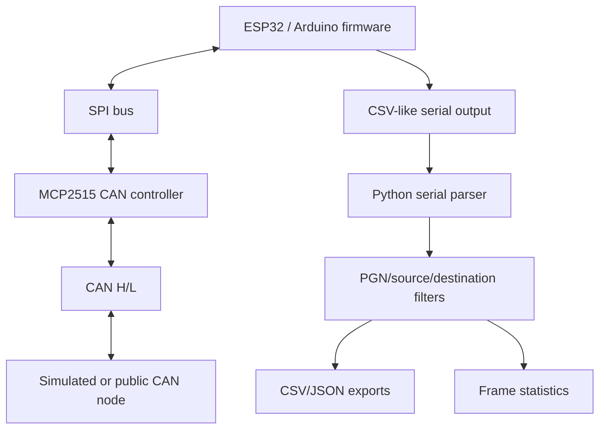

# Architecture

```mermaid
flowchart TD
    ESP32["ESP32 / Arduino firmware"] <--> SPI["SPI bus"]
    SPI <--> MCP2515["MCP2515 CAN controller"]
    MCP2515 <--> CANBus["CAN H/L"]
    CANBus <--> PublicNode["Simulated or public CAN node"]
    ESP32 --> Serial["CSV-like serial output"]
    Serial --> Parser["Python serial parser"]
    Parser --> Filters["PGN/source/destination filters"]
    Filters --> Exports["CSV/JSON exports"]
    Filters --> Stats["Frame statistics"]
```

The firmware side models frame capture and output. The Python side validates parsing and analysis in CI using synthetic frames.

