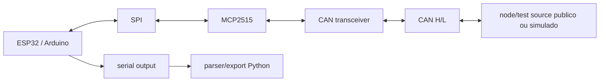

# Bancada CAN/J1939 / Bench Setup

Este documento descreve uma bancada generica e publica. Nao use diagramas, PGNs, logs, placas, clientes, veiculos ou documentos corporativos.

## Arquitetura de bancada



## Componentes

- ESP32 ou placa Arduino compativel.
- Modulo MCP2515 com transceiver CAN.
- Fonte adequada.
- Cabos curtos para SPI.
- Par trancado ou cabos adequados para CAN H/L.
- Dois terminadores de 120 ohms em extremidades do barramento.
- Fonte/test source publico ou simulador CAN.

## Pontos de atencao

- Confirmar clock do MCP2515: muitos modulos usam 8 MHz ou 16 MHz.
- Confirmar bitrate do barramento antes de capturar.
- Usar frames estendidos para J1939.
- Nao conectar em rede veicular real sem autorizacao e isolamento adequado.
- Nao publicar dados vindos de rede real.

## Configuracao publica inicial

```cpp
static constexpr int MCP2515_CS_PIN = 5;
static constexpr int MCP2515_INT_PIN = 4;
static constexpr long CAN_BITRATE = 250000;
static constexpr unsigned long SERIAL_BAUDRATE = 115200;
```

## English Summary

Use a generic ESP32/Arduino plus MCP2515 bench, public/synthetic frame source, correct termination and no private vehicle or fleet data.

